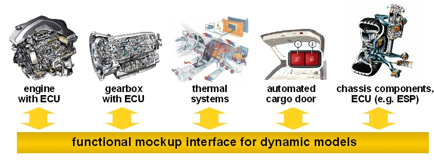
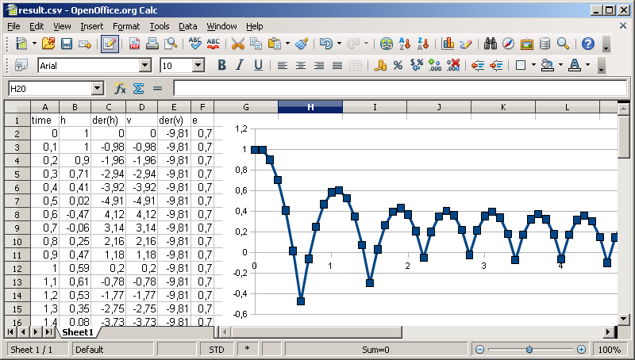
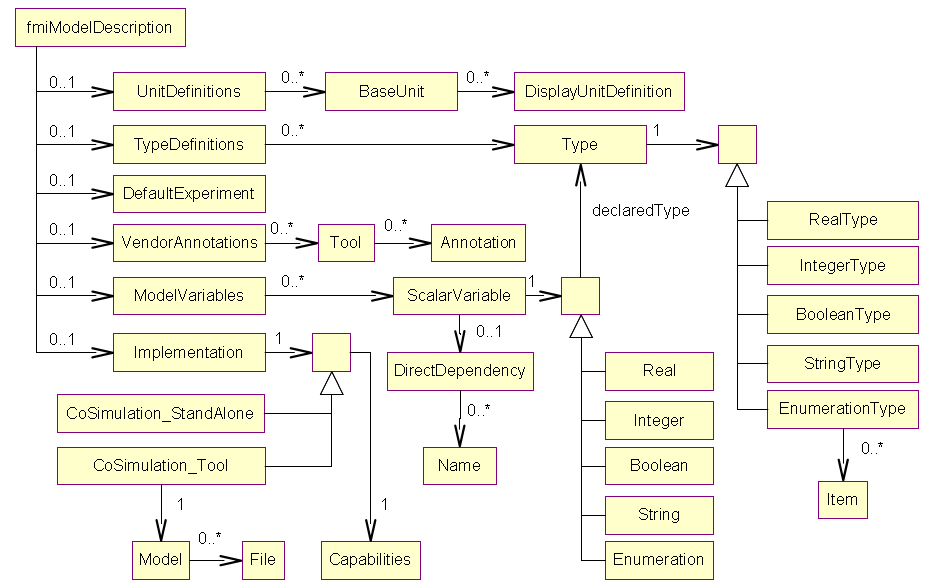

# FMU SDK

The FMU SDK is a free software development kit provided by [QTronic](https://www.qtronic.de/). It demonstrates basic use of Functional Mockup Units (FMUs) as defined by the following Functional Mock-up Interface specifications for

- [Model Exchange and Co-Simulation 2.0](https://svn.modelica.org/fmi/branches/public/specifications/v2.0/FMI_for_ModelExchange_and_CoSimulation_v2.0.pdf) (July 25, 2014)
- [Model Exchange 1.0](https://svn.modelica.org/fmi/branches/public/specifications/v1.0/FMI_for_ModelExchange_v1.0.pdf) (January 26, 2010)
- [Co-Simulation 1.0](https://svn.modelica.org/fmi/branches/public/specifications/v1.0/FMI_for_CoSimulation_v1.0.pdf) (October 12, 2010)

The FMI specifications are available from [here](http://fmi-standard.org/downloads). A short overview on FMUs and the FMI specification can be found [here](http://www.qtronic.de/doc/fmi_overview.pdf). The FMU SDK can also serve as starting point for developing applications that create or process FMUs.

For each of the supported FMI versions (currently 1.0 and 2.0), the FMU SDK contains the C sources for various discrete and continuous FMU models, a batch file for compiling and zipping these models, an XML parser for parsing the model description of an FMU and two simple simulation programs that run a given FMU and output the result as CSV file.

For bug reports, questions or contributions regarding the FMU SDK, please follow the [contribution guide](CONTRIBUTING.md).




# Installing the FMU SDK

The FMU SDK runs on all 32 bit and 64 bit Windows platforms, Linux and Mac OS X platforms. Download the FMU SDK from here, and unzip the file in a directory where you have write access. That directory is called FMUSDK_HOME below and may contain white space, such as in `C:/Program Files/fmusdk`. The FMU SDK contains only the C sources of the FMUs and the simulators, not the executables, and should compile on all Windows, Linux and Mac OS X platforms.

To build Windows 32 bit versions of all FMUs and simulators of the FMU SDK, double click on `FMUSDK_HOME/install.bat`. This should create fmus in `FMUSDK_HOME/fmu10/fmu and FMUSDK_HOME/fmu20/fmu`, as well as four simulators in `FMUSDK_HOME/fmu10/bin and FMUSDK_HOME/fmu20/bin`.

To build Windows 64 bit versions of all FMUs and simulators, open a command shell and run `install -win64`. This creates additional fmus in the `x64` subdirectories in `FMUSDK_HOME/fmu10/fmu` and `FMUSDK_HOME/fmu20/fmu`, as well as additional simulators in `FMUSDK_HOME/fmu10/bin/x64` and `FMUSDK_HOME/fmu20/bin/x64`. Building these 64 bit versions works also on 32 bit Windows platforms. Execution of the 64 bit simulators and fmus requires however a 64 bit version of Windows.

Compilation using install.bat requires that you have installed one of Microsoft Visual Studio 2005 (VS8), 2008 (VS9), 2010 (VS10), 2012 (VS11), 2013 (VS12) or 2015 (VS14), for example the free Express Edition. To compile with another compiler, adapt the batch files.

To build Linux or Mac OS X binaries of all FMUs and simulators, open command shell and run `make`. The build requires that you have installed the C and C++ compilers, libexpat and libxml2 libraries. To install these dependencies on Linux you can use a package manager like `sudo apt install g++`, `sudo apt install libexpat1-dev`, `sudo apt install libxml2-dev`.


## Simulating an FMU

On Windows, to run a given FMU with one of the FMU simulators, open a command shell in directory FMUSDK_HOME and run the command fmusim

```
fmusim simulator model.fmu [tEnd [h [loggingOn [csvSeparator]]]] [-win64]
  simulator ..... cs10 or cs20 for co-simulation, me10 or me20 for model exchange, required
  model.fmu ..... path to FMU, relative to current dir or absolute, required
  tEnd .......... end  time of simulation, optional, defaults to 1.0 sec
  h ............. step size of simulation, optional, defaults to 0.1 sec
  loggingOn ..... 1 to activate logging,   optional, defaults to 0
  csvSeparator .. c for comma, s for semicolon, optional, defaults to c
  -win64 ........ to use a 64 bit simulator. By default, the 32 bit version is
```

This unzips the given FMU, parses the contained modelDescription.xml file, simulates the FMU from t=0 to t=tEnd, and writes the solution to file `result.csv`. The file is written in CSV format (comma-separated values), using `;` to separate columns and using `,` instead of `.` as decimal dot to print floating-point numbers. To change the result file format, use the `CSV separator` option. The logging option activates logging of the simulated FMU. The FMI specification does not specify, what exactly to log in this case. However, when logging is switched on, the sample FMUs of the FMU SDK log every single FMU function call. Moreover, the fmusim simulators log every step and every event that is detected.

Example command:

```
fmusim me10 fmu10/fmu/me/bouncingBall.fmu 5 0.1 0 s
FMU Simulator: run 'fmu/bouncingBall.fmu' from t=0..5 with step size h=0.1, loggingOn=0, csv separator=';'
Simulation from 0 to 5 terminated successful
  steps ............ 51
  fixed step size .. 0.1
  time events ...... 0
  state events ..... 14
  step events ...... 0
CSV file 'result.csv' written
```

On Linux and Mac OS X get inspired by run_all target inside `FMUSDK_HOME/makefile`.

To plot the result file, open it e.g. in a spread-sheet program, such as Miscrosoft Excel or OpenOffice Calc. The figure below shows the result of the above simulation when plotted using OpenOffice Calc 3.0. Note that the height h of the bouncing ball as computed by fmusim becomes negative at the contact points, while the true solution of the FMU does actually not contain negative height values. This is not a limitation of the FMU, but of fmusim_me, which does not attempt to locate the exact time of state events. To improve this, either reduce the step size or add your own procedure for state-event location to fmusim_me.




## Creating your own FMUs

The FMU SDK contains a few sample FMUs

- [dq](fmu20/src/models/dq/index.html) the Dahlquist test function x = -k der(x)
- [inc](fmu20/src/models/inc/index.html) increments an integer counter every second
- [values](fmu20/src/models/values/index.html) demonstrates the use of all scalar FMU data types
- [vanDerPol](fmu20/src/models/vanDerPol/index.html) ODE with 2 continuous states
- [bouncingBall](fmu20/src/models/bouncingBall/index.html) a bouncing ball that defines state events

To implement your own FMU using the FMU SDK, create a directory - say xy - in `FMUSDK_HOME/fmu10/src/models`, or `FMUSDK_HOME/fmu20/src/models`, and create files xy.c there. The name of the new directory and of the .c file must be the same. The content of the .c file should follow the existing FMU examples, see the comments in the example code. For FMI 1.0, add also file modelDescription.xml. The XML file must not contain the <implementation> element and the closing <fmiModelDescription> tag, because this is added automatically during build. For FMI 2.0, add file modelDescription_cs.xml and modelDescription_me.xml. When done with editing xy.c and the xml file (or files), open a command shell in `FMUSDK_HOME/fmu10/src/models` or in `FMUSDK_HOME/fmu20/src/models` to run the build command.

On Windows, run command build_fmu me xy to build an FMU for model-exchange, or build_fmu cs xy to build an FMU for co-simulation. This should create a 32 bit FMU file xy.fmu in the corresponding subdirectory of FMUSDK_HOME/fmu10 or FMUSDK_HOME/fmu20. To build a 64-bit FMU, append option -win64 to the build command.
For Linux and Mac OS X get inspired by all target inside `FMUSDK_HOME/fmu10/src/models/makefile` and `FMUSDK_HOME/fmu20/src/models/makefile`.

The figure below might help to create or process the XML file modelDescription.xml. It shows all XML elements (without attributes) used in the schema files (XSD) for model exchange and co-simulation 1.0. Notation: UML class diagram.



For the case of FMU 2.0, see the corresponding overview figure in the [FMI specification 2.0](https://svn.modelica.org/fmi/branches/public/specifications/v2.0/FMI_for_ModelExchange_and_CoSimulation_v2.0.pdf).


## Release notes

### 07.02.2010, Version 1.0
- First release
- demo FMI for Model Exchange 1.0

### 05.03.2010, Version 1.0.1
- demo FMI for Model Exchange 1.0
- bug-fix in fmuTemplate.c: fmiSetString now copies the passed string argument and fmiFreeModelInstance frees all string copies
- fmusim/main.c: removed strerror(GetLastError()) from error messages

### 22.08.2011, Version 1.0.2
- demo FMI for Model Exchange 1.0 and FMI for Co-Simulation 1.0
- added support for FMI for Co-Simulation 1.0 (standalone, no tool coupling)
- bug-fix in fmusim/main.c: added missing calls to fmiTerminate and fmiFreeModelInstance

### 07.03.2014, Version 2.0.0
- demo FMI for versions 1.0 and 2.0 RC1
- added support for FMI 2.0 RC1
- added 64 bit support
- more compilers recognized by the installer

### 16.04.2014, Version 2.0.1
- bug-fix in modelDescription.xml files: remove alias parameter, add derivative attribute to suitable variables
- bug-fix in fmu20/fmuTemplate.c: allow modules to request termination of simulation, better time event handling, initialize() moved from fmiEnterInitialization to fmiExitInitialization, correct logging message format in fmiDoStep
- bug-fix in Co-Simulation and Model Exchange simulators: set fmu location for 1.0 and fmu resources location for 2.0 at instantiation of model

### 02.07.2014, Version 2.0.2
- added support for FMI 2.0 RC2
- remove support for exporting FMI 2.0 RC1. Co-Simulation and Model Exchange simulators still support FMI 2.0 RC1
- fmi2setDebugLogging called with 0 categories, set all categories to loggingOn value

### 27.08.2014, Version 2.0.3
- track all states of Model-exchange and Co-simulation and check the allowed calling sequences for FMI 2.0
- added explicit 'isTimeEvent' parameter for eventUpdate function in the user's models
- lazy computation of computed values
- bug-fix in modelDescription.xml: set initial attribute to local and output variables, add unknown variables in <ModelStructure><InitialUnknowns> section

### 20.10.2015, Version 2.0.4
- added explicit 'isNewEventIteration' parameter for eventUpdate function in the user's models
- bouncingBall example improvement: demonstrate tunable parameters, avoid 'fall through effect' due to numerical calculation
- bug-fix: allow to declare real variables and zero states in a model
- bug-fix: allow to simulate FMI 2.0 RC1 models
- bug-fix: remove memory leaks and compilation warnings

### 8.12.2017, Version 2.0.5
- added support for Linux and Mac OS X. Thanks to @cxbrooks
- added support for building with Microsoft VS 2015
- location of simulators changes to FMUSDK_HOME\fmu10\bin and FMUSDK_HOME\fmu20\bin instead of FMUSDK_HOME\bin
- fmu20 build define DISABLE_PREFIX to not use prefixed FMI functions
- fmu20 models declare source files in ModelDescription.xml
- log error messages regardless of loggingOn flag when functions return fmi2Error
- bug-fix: allow to declare real variables and zero states

### 20.07.2018, Version 2.0.6
- update libxml2.lib to work for windows 7 and Visual Studio 2013 and 2015
- linux - give exec right to build_fmu.sh before executing it
- copy .h model files with rsync to avoid missing file error


## License

The FMU SDK is provided by QTronic under the [BSD 2-Clause License](LICENSE.md).

The following additional tools are distributed with the FMU SDK under their respective licenses:

- [7z 4.57](http://www.7-zip.org/) by Igor Pavlov, used here to zip and unzip FMUs ([7-Zip License for use and distribution](fmu10/bin/License.txt))
- [eXpat 2.0.1](http://sourceforge.net/projects/expat/) by James Clark, used here to parse the modelDescription.xml file of an FMU 1.0 ([MIT License](fmu10/src/shared/COPYING.txt))
- [libxml](http://xmlsoft.org/), the XML C parser and toolkit of Gnome, used here to parse the modelDescription.xml file of an FMU 2.0 ([MIT license](fmu20/src/shared/parser/libxml_license.txt)).

The contribution guide is adapted from [normalize.css](https://github.com/necolas/normalize.css) ([MIT License](https://github.com/necolas/normalize.css/blob/master/LICENSE.md)) and [chris.beams.io](https://chris.beams.io/posts/git-commit/)
